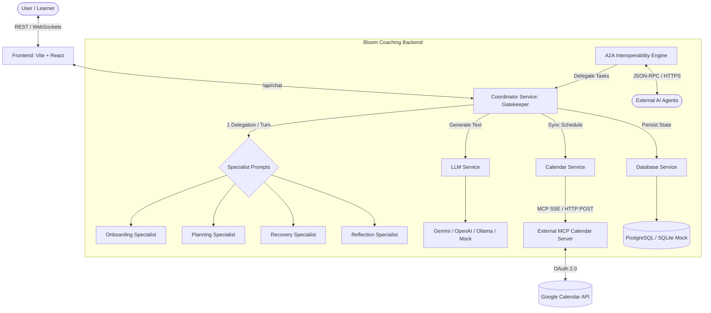

# Bloom Coaching Application

Bloom is an AI-powered conversational coaching platform designed to help learners co-create sustainable learning habits, manage their study schedules, reflect on progress, and recover supportively from schedule disruptions. 

Unlike traditional LMS platforms, Bloom adheres strictly to **agency-first coaching**, leaving all scheduling decisions to the learner and integrating directly with external calendars via the **Model Context Protocol (MCP)**.

---

## 1. System Architecture

Bloom is architected around a centralized gatekeeper pattern to manage dialog states, apply safety filters, and orchestrate specialized agents without cascading orchestrations.



### Core Architecture Components

1. **Frontend (Vite + React)**
   * A clean, premium user interface designed with rich aesthetics and responsive layouts.
   * Orchestrates the chat experience and displays the live coaching dashboard.

2. **Coordinator Service (The Gatekeeper)**
   * The central entry point for all user-facing interactions.
   * Manages dialogue states, runs input/output **Safety Filters** (guilt, shaming, and productivity extremism block patterns), and delegates to specialists (max 1 delegation per turn).

3. **Specialist Agents (Stateless Prompts)**
   * **Onboarding Specialist**: Guides learners through states S1-S6 to map goals, availability, and focus windows.
   * **Planning Specialist**: Co-creates weekly study schedules within ±10% of the user's weekly time budget, offering two distinct options.
   * **Recovery Specialist**: Triggers 2 hours after a missed session to explore schedule blockers and reschedule.
   * **Reflection Specialist**: Initiates reflective dialogue post-session to build positive feedback loops.

4. **Calendar Service (Dual-Mode MCP Integration)**
   * Integrates `@modelcontextprotocol/sdk` supporting **Server-Sent Events (SSE)**.
   * Exposes a direct **HTTP POST JSON-RPC fallback** allowing plug-and-play connections to local custom calendar servers.
   * Integrates a 2-second connection timeout, failing back to local in-memory representation.

5. **A2A Interoperability Engine**
   * Exposes external task delegation APIs using standard JSON-RPC over HTTPS.
   * Integrates signed **Agent Cards** (`/.well-known/agent.json`) for agent-to-agent contract verification.

6. **Database Service**
   * Dynamic DB connector that automatically falls back to an in-memory SQL mock if PostgreSQL is unconfigured.

---

## 2. Technology Stack

* **Frontend**: React, Vite, CSS variables, HSL color palettes.
* **Backend**: Node.js, Express, TypeScript, Jest, ts-jest.
* **Integrations**: `@modelcontextprotocol/sdk`, `@google/generative-ai`, `openai`.
* **Testing**: Jest unit and integration test suite (contract, A2A, state machines).

---

## 3. Getting Started

### Prerequisites
* **Node.js**: `v20` or higher
* **npm**: `v10` or higher

### Installation
```bash
# Clone the repository
git clone github.com:cacaprog/bloom-learning-app.git
cd bloom-learning-app

# Install Backend Dependencies
cd backend
npm install

# Install Frontend Dependencies
cd ../frontend
npm install
```

### Running Locally
```bash
# Run backend server (runs on http://localhost:3000)
cd backend
npm run dev

# Run frontend client (runs on http://localhost:5173)
cd ../frontend
npm run dev
```

For detailed deployment parameters, database migration commands, and API verification cURLs, check out the [Bloom Coaching Core Runbook](file:///home/cairo/code/bloom-learning/my-project/runbook.md).
