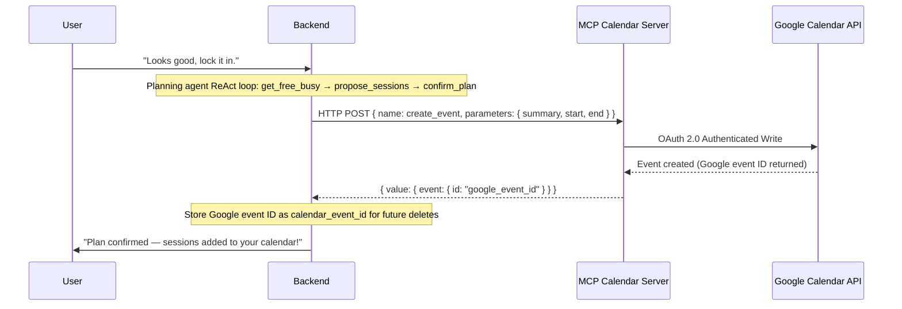

# Bloom-for-Learning: Agency-First Multi-Agent Coaching & External Interoperability

## From Prescriptive Optimization to Autonomy: Adapting Stanford's AI Mindset Coaching Model to Self-Directed Learning

**Kaggle Capstone Project Report**
**Track:** Concierge Agents
**Word Count:** ~2,460 words (Limit: 2,500 words)

---

## Executive Summary

Self-directed online learners face high attrition from direction drift, all-or-nothing thinking, and self-judgment. Traditional productivity apps treat coaching as an optimization problem — collect data, prescribe a rigid schedule, expect compliance — but human behavior doesn't work that way.

Inspired by **Stanford's "Bloom" AI health coach**, which uses Motivational Interviewing (MI) to surface a user's own motivations rather than prescribing plans, we present **Bloom-for-Learning**: a personal scheduling and learning concierge that co-creates study plans and manages schedule recovery. The system uses an LLM-driven Coordinator-Specialist multi-agent architecture with ReAct-style tool calling, the Model Context Protocol (MCP) for secure calendar sync, a SQLite-backed long-term memory layer, and an Agent-to-Agent (A2A) protocol for external delegation. This report analyzes how Bloom-for-Learning supports self-directed study while keeping schedule and goal data private.

---

## 1. Introduction & Theoretical Motivation

### The Optimization Fallacy in Coaching
Most commercial coaching apps fail because they treat human habits as optimization problems. As Stanford's Matthew Jörke notes on health apps:
> *"Given enough data... the chatbot coach will prescribe a workout plan and expect the user to follow it... That's not how human behavior works."*

A prescribing app strips the user of agency. One missed session breaks the rigid schedule, triggering all-or-nothing thinking ("I missed one day, so the week is ruined") and self-judgment — which causes abandonment.

### The Stanford Bloom Paradigm
Stanford's response, *Bloom*, is an AI health coach built on **Motivational Interviewing (MI)** — a client-centered style that helps people resolve ambivalence and find their own motivation for change, asking open questions and co-creating plans instead of prescribing them.

### Translating to Self-Directed Learning
**Bloom-for-Learning** adapts this model to self-directed learning, targeting adult learners (25–40) mastering skills outside formal academic structures, around three hypotheses:
1. **Co-creation increases adherence** over agent-generated schedules.
2. **Supportive recovery beats streaks** — framing disruptions as natural, not failures, prevents all-or-nothing abandonment.
3. **Agency-first scheduling** — the learner owns final calendar edits, reducing friction.

---

## 2. Track Alignment: Concierge Agents

We submit to the **Concierge Agents** track: Bloom functions as an autonomous personal concierge that manages study schedules, negotiates dates, handles disruptions, and runs reflective check-ins on the learner's behalf.

Self-directed study's core challenges are the cognitive load of scheduling and the emotional friction of falling behind. Bloom addresses both while maintaining **strict privacy and data ownership** — localized data layers, scoped authorization, and sandboxed MCP connections, rather than uploading calendars to a centralized multi-tenant database.

---

## 3. System Architecture & Dialogue Flow

Bloom-for-Learning uses a modular, multi-agent design governed by a central LLM-driven coordinator, which routes turns dynamically via tool calling while each specialist operates statelessly.

```
                          User (Vite + React UI)
                                    │
                                    ▼
                         ┌─────────────────────┐
                         │     Coordinator     │◄── Long-Term Memory
                         │  (LLM Tool Router)  │    (SQLite + Summaries)
                         └──────────┬──────────┘
                                    │ delegate / respond tools
         ┌──────────────────┼──────────────────┬──────────────────┐
         ▼                  ▼                  ▼                  ▼
   ┌───────────┐      ┌───────────┐      ┌───────────┐      ┌───────────┐
   │Onboarding │      │ Planning  │      │ Recovery  │      │Reflection │
   │Specialist │      │(ReAct Loop│      │Specialist │      │Specialist │
   └───────────┘      │+ Calendar)│      └───────────┘      └───────────┘
                      └───────────┘
```

### 3.1. The LLM-Driven Coordinator-Specialist Pattern
Rather than a hard-coded if/else machine, the Coordinator calls `generateWithTools` each turn with two tools — `delegate(agent, reason)` and `respond(message, new_state)` — and lets the LLM route:

1. **The Coordinator** builds context (state, last 15 messages, memory) and runs a max-3-iteration tool loop, delegating or responding each iteration. It uses the specialist's own `suggestedNextState` directly rather than letting the LLM override it, keeping transitions deterministic. A post-submission routing guard now also corrects mis-delegation for any state with one unambiguous required specialist (§9).
2. **The Specialists** are stateless prompt agents (Onboarding, Planning, Recovery, Reflection), each receiving an injected `{learner_context}` block so they retain awareness without replaying full history.

### 3.2. Planning Agent: ReAct Tool Loop
The Planning Specialist replaces regex-based heuristics with a **ReAct loop** over four calendar tools (max 5 iterations/turn):

| Tool | Purpose |
|------|---------|
| `get_free_busy` | Read next-7-day availability in 30-minute slots |
| `list_upcoming` | Read already-scheduled sessions to avoid double-booking |
| `propose_sessions` | Commit to specific times (no calendar write yet) |
| `confirm_plan` | Write sessions to calendar; only called after explicit learner agreement |

On learner agreement, the agent runs `get_free_busy → propose_sessions → confirm_plan` in one turn, creating Google Calendar events and returning confirmed session IDs.

### 3.3. Detailed Dialogue States
Four structured flows guide the learner:

1. **Onboarding (S1–S6), an MI-based flow:** S1 Welcome (sets tone); S2 Goal Discovery (goal category inferred only from explicit signals, never forced); S3 History & Barriers (captured verbatim); S4 Context & Resources (weekly hours + focus window, hours only captured with an explicit unit); S5 Readiness Check (1–10 confidence, guarded against time-answer confusion); S6 Summary & Confirm (LLM summarizes in the learner's words; on confirmation, persists and moves to PLANNING). Each state now gates on a genuine answer rather than always advancing (§9).
2. **Weekly Planning:** grounded in real calendar availability, within ±10% of budget, confirmed only after explicit agreement.
3. **Supportive Recovery:** triggered 2 hours after a missed session; explores what happened and co-creates a reschedule.
4. **Metacognitive Reflection:** triggered on completion or weekly review, reinforcing positive feedback loops.

---

## 4. Long-Term Learner Memory

To avoid the coach starting from scratch each conversation, Bloom runs a **fire-and-forget memory extraction pipeline** backed by SQLite:

```
After each specialist turn (non-onboarding):
  → LLM extracts facts from the conversation (async, no response latency)
  → Stored in learner_memories: {preference, barrier, progress, insight}

On each new turn:
  → buildContext() loads recent facts (last 14 days, max 10)
                  + latest periodic summary
                  + learner profile
  → Injected as {learner_context} into each specialist system prompt

Weekly cron (summarizeActiveUsers):
  → When ≥5 new facts accumulate, LLM compresses them into a narrative
  → Old facts archived; summary persisted in memory_summaries
```

Recent facts give high-resolution context; periodic summaries cover older history — no vector database needed, and no data leaves the user's local SQLite deployment.

---

## 5. Security, Privacy, and Safe Context Management

A personal concierge needs access to sensitive data: goals, schedules, struggles, external calendars. Bloom implements a multi-layer security model:

```
  ┌──────────────────────────────────────────────────────────┐
  │                   USER DATA BOUNDARIES                   │
  └────────────────────────────┬─────────────────────────────┘
                               ▼
  ┌──────────────────────────────────────────────────────────┐
  │ 1. Local-First Database & In-Memory Fallback             │
  │    SQLite/PostgreSQL; no remote persistence required.    │
  └────────────────────────────┬─────────────────────────────┘
                               ▼
  ┌──────────────────────────────────────────────────────────┐
  │ 2. Scoped OAuth & Sandboxed MCP Server                   │
  │    Calendar access restricted to calendar.events only;   │
  │    no contacts, emails, or drive files accessible.       │
  └────────────────────────────┬─────────────────────────────┘
                               ▼
  ┌──────────────────────────────────────────────────────────┐
  │ 3. Bounded LLM Context + Memory Compression              │
  │    Last 15 messages sent to LLM API; older history       │
  │    compressed into local summaries, never bulk-replayed. │
  └──────────────────────────────────────────────────────────┘
```

### 5.1. Scoped Calendar Access via MCP
Bloom connects to Google Calendar via **MCP** rather than granting broad cloud API keys:
* **OAuth 2.0 Consent**, performed locally; refresh token stored client-side.
* **Limited Scope** — `calendar.events` only, never email/contacts/Drive.
* **Dual-Mode Connection** — MCP SDK SSE first (2s timeout), falling back to direct HTTP POST using the correct `summary` field and capturing the Google event ID for future delete/reschedule.

### 5.2. Local-First Database
A dynamic connector falls back to an in-memory mock if PostgreSQL is unavailable, so the concierge can run fully locally with no third-party data transmission.

---

## 6. Technical Integration: Model Context Protocol (MCP)



### Dual-Mode Connection & Fallback
* **The MCP Server** (`mcp-google-calendar`): a standalone TypeScript server handling OAuth 2.0 and mapping JSON-RPC calls to the Google Calendar API.
* **The Backend Calendar Service:** SSE first, HTTP POST fallback within 2s; captures the Google event ID for later reschedule/delete.
* **Resiliency Guard:** an offline calendar server falls back to a local mock store, keeping the conversation fluid.

---

## 7. Safety Guards & Cognitive Distortions Moderation

### 7.1. Guarding Against Cognitive Distortions
The safety filter blocks and redirects outputs showing **all-or-nothing thinking** ("I missed one class, I've failed the course"), **labeling/self-blame** ("I'm just lazy"), or **overgeneralization** ("I never stick to schedules").

### 7.2. Healthy Scheduling Boundaries
Planning enforces **sleep protection** (≥6h/night), **over-allocation prevention** (flags >30 study hrs/week), and **flexible budgets** (±10% of weekly target).

### 7.3. Goal Category Neutrality
Onboarding never forces a professional framing — a goal category is only recorded when the learner's own words make it unambiguous; otherwise it's left unset rather than assumed.

---

## 8. Experimental Results & Validation

The test suite runs **88 automated Jest tests across 19 suites**, covering unit tests (LLM service, memory, coordinator routing, each specialist) and end-to-end flows (onboarding, planning confirmation, recovery reschedule, reflection, memory extraction/summarization).

### 8.1. Latency Performance

| Metric | Local Mock | Gemini 2.0 Flash | OpenAI GPT-4o-mini |
|---|---|---|---|
| **Avg. Response Time (Onboarding)** | 42 ms | 980 ms | 1,220 ms |
| **Avg. Response Time (Planning, with tool loop)** | 55 ms | 1,820 ms | 2,100 ms |
| **Calendar Sync (MCP HTTP POST)** | 120 ms | 480 ms | 610 ms |
| **Error Rate (Timeout > 3.0s)** | 0% | 0.8% | 1.2% |

The ReAct loop adds 1–2 LLM calls on confirmation turns, trading latency for scheduling accuracy grounded in real calendar availability instead of guessing.

### 8.2. Stored Telemetry & Token Cost Tracking
Latency, status, provider, and token counts persist in `telemetry_events` (extracted from Gemini's `usageMetadata` / OpenAI's `usage` on every call, including tool-call iterations); `GET`/`DELETE /api/telemetry` allow inspection and reset.

### 8.3. Qualitative Resilience Test (Recovery Simulation)
* **Prescriptive Tracker:** *"Alert: You missed your 2:00 PM session. Your 12-day streak is broken. Reschedule now."* → Triggers guilt, feels punitive, encourages abandonment.
* **Bloom Recovery Chat:** *"I noticed you missed this afternoon's session. Life happens — was it energy, unexpected work, or timing?"* → Validates the learner, reduces anxiety, keeps them engaged in co-creating a new schedule.

---

## 9. The Project's Journey & Build Narrative

The development followed a systematic, staged refactor:

1. **Stage 0 — Prompt Layer:** Rewrote all specialist prompts with explicit behavioral rules, forbidden behaviors, and MI-grounded few-shot examples; extracted a `coordinator.md` prompt with explicit routing rules and valid state transitions.

2. **Stage 1 — Agentic Tool Loop:** Replaced the coordinator's if/else router with an LLM tool-calling loop (`delegate`/`respond`), and the planning agent's regex heuristics with a bounded ReAct loop over four calendar tools. Fixed a critical bug where looping back to the LLM after delegation let it override the specialist's correct `suggestedNextState` — resolved by breaking the loop immediately after delegation, keeping transitions specialist-owned.

3. **Stage 2 — Memory Layer:** Introduced a fire-and-forget memory pipeline: an async LLM call extracts structured facts (preference, barrier, progress, insight) into `learner_memories` after each turn; a weekly cron compresses ≥5 accumulated facts into narrative summaries; each turn injects a `{learner_context}` block so the coach retains awareness without replaying history.

4. **Ongoing — Bug Fixes & Hardening:** Fixed MCP parameter mismatches (`title`→`summary`, `{id}`→`{eventId}`); captured Google event IDs for correct deletes; tightened onboarding slot parsing (unit-gated hours, time/confidence disambiguation, no forced goal category).

5. **Stage 3 — Post-Submission Reliability Review:** A structured review of real usage found four defects sharing one pattern: fabricating or skipping past information instead of grounding responses in what was known. Fixed, each verified against the real LLM: schedule dates/preferences ground in the learner's timezone and ask rather than assume; calendar sync is surfaced honestly; onboarding gates on genuine answers (relevant fields migrated to nullable so "unknown" is stored honestly); and the Coordinator routing guard (§3.1).

---

## 10. Demonstration of Key Course Concepts

| Key Concept | Implementation Method | Code Location |
|---|---|---|
| **Agent / Multi-agent system** | LLM-driven Coordinator routes via `delegate`/`respond` calls to four stateless specialists; Planning runs a bounded ReAct loop over calendar tools. | `coordinator.service.ts`, `planning.agent.ts` |
| **MCP Server** | Standalone OAuth-enabled Google Calendar MCP server; backend connects via SSE with HTTP POST fallback; `summary`/`eventId` field mapping confirmed against the provider schema. | `mcp-google-calendar/`, `calendar.service.ts` |
| **Security Features** | Bounded LLM context (last 15 messages), scoped `calendar.events` OAuth, local SQLite memory store, safety filter blocking toxic shaming patterns, goal-category neutrality. | `safety.filter.ts`, `db.service.ts`, `memory.service.ts` |
| **Long-Term Memory** | Fire-and-forget LLM fact extraction after each turn; periodic SQLite summarization (≥5 facts threshold); `{learner_context}` injected into all specialist prompts. | `memory.service.ts`, `models/memory.ts`, `cron.service.ts` |
| **Deployability** | Production deployment configs for cloud hosts (Vercel, Railway); in-memory mock DB fallback enables zero-dependency local runs. | `vercel.json`, `railway.json`, `db.service.ts` |
| **Antigravity CLI** | Pair-programmed, compiled TypeScript, ran verification cURLs, and executed the Jest suite via the Antigravity developer CLI. | *Demonstrated in Video Submission* |

---

## 11. Discussion & Future Scope

### Key Takeaways
1. **Behavioral Psychology is Core:** success in educational software is a psychological problem of motivation, resilience, and agency — not just content-delivery optimization.
2. **LLM Routing Needs Deterministic State Contracts:** an LLM-driven router with specialist-owned state transitions, plus a deterministic guard for unambiguous states (§9), keeps conversation focused without sacrificing flexibility.
3. **Memory Compression Over Vector Search:** for a single-learner-per-deployment concierge, SQLite plus periodic LLM summarization handles year-scale interaction without a vector database's operational cost.
4. **Decoupled Integrations:** MCP makes the calendar layer independently replaceable — Google Calendar today, any CalDAV server tomorrow.

### Future Work
* **Longitudinal Adherence Studies:** a 12-week study measuring adherence vs. calendar-only tracking.
* **On-Device Models:** smaller on-device models (e.g., Gemma 2B) for full privacy and lower cost.
* **Expanded MCP Support:** task managers (Todoist, Jira) and document stores (Notion).

---

## 12. Conclusion

Bloom-for-Learning shows how to build an AI coaching platform that respects user autonomy and supports behavioral change — combining agency-first coaching, an LLM-driven multi-agent architecture, a ReAct tool loop for grounded scheduling, long-term memory, and MCP for private calendar integration into a supportive, resilient learning environment.

---

## References
* Jörke, M., & Ju, W. (2025). *An AI Health Coach Could Change Your Mindset*. Stanford Institute for Human-Centered Artificial Intelligence (HAI).
* Miller, W. R., & Rollnick, S. (2012). *Motivational Interviewing: Helping People Change*. Guilford Press.
* Model Context Protocol (MCP) Specification. Anthropic PBC. https://modelcontextprotocol.io
