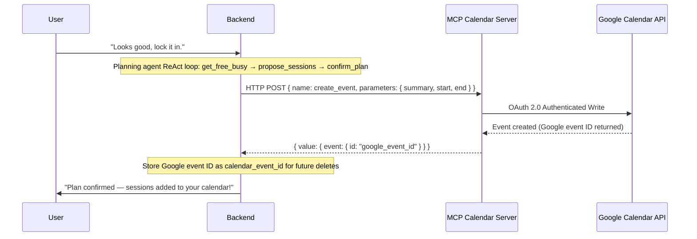

# Bloom-for-Learning: Agency-First Multi-Agent Coaching & External Interoperability

## From Prescriptive Optimization to Autonomy: Adapting Stanford's AI Mindset Coaching Model to Self-Directed Learning

**Kaggle Capstone Project Report**
**Track:** Concierge Agents
**Word Count:** ~2,500 words (Limit: 2,500 words) — recheck with your submission tool before finalizing

---

## Executive Summary

Self-directed online learners face high attrition rates due to psychological barriers such as direction drift, all-or-nothing thinking, and self-judgment. Traditional productivity applications treat planning and coaching as a mathematical optimization problem: they collect data, prescribe a rigid schedule, and expect perfect compliance. However, behavioral science shows that human behavior does not conform to rigid optimization.

Inspired by **Stanford University's "Bloom" AI health coach**—which leverages Motivational Interviewing (MI) to help users tap into their intrinsic motivations rather than prescribing health plans—we present **Bloom-for-Learning**. Bloom-for-Learning operates as a personal scheduling and learning concierge, co-creating study plans and managing schedule recoveries. This system leverages an LLM-driven Coordinator-Specialist multi-agent architecture with ReAct-style tool calling, implements the Model Context Protocol (MCP) for secure, client-delegated calendar synchronization, a long-term learner memory layer backed by SQLite, and exposes an Agent-to-Agent (A2A) protocol for decentralized delegation. This report provides a detailed analysis of how Bloom-for-Learning solves the individual challenge of self-directed study while keeping personal schedule and goal data safe and secure.

---

## 1. Introduction & Theoretical Motivation

### The Optimization Fallacy in Coaching
Most commercial productivity and wellness coaching gadgets fail because they treat human habits as optimization problems. As Matthew Jörke, a graduate student in computer science at Stanford University, notes regarding health apps:
> *"Given enough data collected from an app, the chatbot coach will prescribe a workout plan and expect the user to follow it... That's not how human behavior works."*

When an app acts as a prescribing authority, it strips the user of their agency. If a user encounters an unexpected life event and misses a session, the rigid schedule breaks. This triggers all-or-nothing thinking (e.g., "I missed one day, so the week is ruined") and self-judgment (guilt and shame), which ultimately causes the user to abandon the app and their learning goals.

### The Stanford Bloom Paradigm
To address this, Stanford researchers developed *Bloom*, an AI health coach based on **Motivational Interviewing (MI)**. MI is a clinical, client-centered communication style that helps individuals resolve ambivalence and tap into their own intrinsic motivations for change. Instead of telling the user what to do, the coach asks open-ended questions, reflects the user's values, and co-creates plans.

### Translating to Self-Directed Learning
**Bloom-for-Learning** adapts this motivational health coaching model to the domain of self-directed learning. We target adult self-learners (ages 25–40) who are attempting to master complex skills (e.g., programming, data science, language learning) outside formal academic structures. The system is designed around three core behavioral hypotheses:
1. **Co-creation increases adherence:** A learner is more likely to follow a study schedule if they actively co-create it with the agent rather than having it generated for them.
2. **Supportive recovery beats streaks:** Framing schedule disruptions as natural learning moments, rather than failures, prevents all-or-nothing abandonment.
3. **Agency-first scheduling:** Decoupling scheduling decisions from the AI—letting the learner own the final calendar edits—reduces planning friction while keeping the user in control.

---

## 2. Track Alignment: Concierge Agents

We submit this project to the **Concierge Agents** track.

Bloom-for-Learning fits this track because it functions as an autonomous personal concierge designed to streamline, simplify, and support an individual's educational path. Managing study schedules, negotiating dates, handling disruptions, and conducting reflective check-ins are tasks that require a secure agent working on behalf of the user.

In self-directed study, a primary challenge is the cognitive load of scheduling and the emotional friction of falling behind. Bloom addresses this social and individual challenge while maintaining a **strict boundary of privacy, security, and user data ownership**. Rather than uploading broad calendars to a centralized, multi-tenant AI database, Bloom-for-Learning uses localized data layers, strict authorization scopes, and sandboxed Model Context Protocol connections to keep personal information secure.

---

## 3. System Architecture & Dialogue Flow

Bloom-for-Learning utilizes a modular, multi-agent design governed by a central LLM-driven coordinator. The coordinator uses tool calling to make routing decisions dynamically, while each specialist operates statelessly within its own turn.

```
                          User (Vite + React UI)
                                    │
                                    ▼
                         ┌─────────────────────┐
                         │     Coordinator     │◄── Long-Term Memory
                         │  (LLM Tool Router)  │    (SQLite + Summaries)
                         └──────────┬──────────┘
                                    │ delegate / respond tools
         ┌──────────────────┼──────────────────┬──────────────────┐
         ▼                  ▼                  ▼                  ▼
   ┌───────────┐      ┌───────────┐      ┌───────────┐      ┌───────────┐
   │Onboarding │      │ Planning  │      │ Recovery  │      │Reflection │
   │Specialist │      │(ReAct Loop│      │Specialist │      │Specialist │
   └───────────┘      │+ Calendar)│      └───────────┘      └───────────┘
                      └───────────┘
```

### 3.1. The LLM-Driven Coordinator-Specialist Pattern
Rather than using a hard-coded if/else state machine, the Coordinator calls `generateWithTools` each turn with two tools — `delegate(agent, reason)` and `respond(message, new_state)` — and lets the LLM make routing decisions:

1. **The Coordinator:** Builds conversation context (current state, last 15 messages, learner memory context), then runs a max-3-iteration tool loop. On each iteration it either delegates to a specialist or responds directly. After a delegation the coordinator uses the specialist's returned `suggestedNextState` directly — the LLM does not override the state — which makes state transitions deterministic regardless of model provider. A routing guard added post-submission corrects mis-delegation for states with one unambiguous specialist (§9).
2. **The Specialists:** Stateless prompt agents that handle single-turn tasks (Onboarding, Planning, Recovery, Reflection). Each receives an injected `{learner_context}` block from the memory layer, giving them awareness of the learner's history without requiring full conversation replay.

### 3.2. Planning Agent: ReAct Tool Loop
The Planning Specialist replaces regex-based schedule heuristics with a **ReAct (Reason + Act) loop** over four calendar tools, with a maximum of five iterations per turn:

| Tool | Purpose |
|------|---------|
| `get_free_busy` | Read next-7-day availability in 30-minute slots |
| `list_upcoming` | Read already-scheduled sessions to avoid double-booking |
| `propose_sessions` | Commit to specific times (no calendar write yet) |
| `confirm_plan` | Write sessions to calendar; only called after explicit learner agreement |

When the learner says "yes" the planning agent runs the full sequence — `get_free_busy → propose_sessions → confirm_plan` — in a single turn, creating Google Calendar events via the MCP server and returning confirmed session IDs.

### 3.3. Detailed Dialogue States
The system guides the user through four structured flows:

1. **Onboarding (States S1–S6):** A motivational interviewing flow.
   * **S1 — Welcome:** Sets tone; explains the agency-first approach.
   * **S2 — Goal Discovery:** Explores intrinsic motivation. Goal category is inferred only from explicit signals (e.g., "coding" → technical, "fun" → personal); no default label is forced.
   * **S3 — History & Barriers:** Past attempts and specific blockers (fatigue, family, work), captured verbatim from the learner's own words.
   * **S4 — Context & Resources:** Weekly time budget (hours) and best focus window (morning, afternoon, evening). Hours are only captured when the learner explicitly mentions a unit ("5 hours", "3 hrs/week").
   * **S5 — Readiness Check:** Confidence score (1–10). The parser guards against confusion with time answers — if the message references hours, the score is left unset and the LLM re-asks.
   * **S6 — Summary & Confirm:** LLM summarizes the full profile in the learner's own words. On confirmation, the profile is persisted and the state transitions to PLANNING. Each state now gates on genuine answers rather than always advancing (§9).
2. **Weekly Planning:** The coach co-creates a study plan grounded in real calendar availability. The planning agent checks free/busy slots, proposes sessions that fit the learner's weekly budget (±10%), and confirms only after explicit learner agreement.
3. **Supportive Recovery:** Triggered automatically two hours after a missed session. Instead of punitive alerts, the agent explores what got in the way and co-creates a reschedule via the MCP calendar.
4. **Metacognitive Reflection:** Triggered on session completion or weekly review. The coach prompts reflection on focus and energy to reinforce positive feedback loops.

---

## 4. Long-Term Learner Memory

To prevent the coach from starting from scratch on every conversation, Bloom implements a **fire-and-forget memory extraction pipeline** backed by SQLite:

```
After each specialist turn (non-onboarding):
  → LLM extracts facts from the conversation (async, no response latency)
  → Stored in learner_memories: {preference, barrier, progress, insight}

On each new turn:
  → buildContext() loads recent facts (last 14 days, max 10)
                  + latest periodic summary
                  + learner profile
  → Injected as {learner_context} into each specialist system prompt

Weekly cron (summarizeActiveUsers):
  → When ≥5 new facts accumulate, LLM compresses them into a narrative
  → Old facts archived; summary persisted in memory_summaries
```

This design handles multi-month interaction gracefully: recent facts provide high-resolution context while periodic summaries cover older history, with no vector database required. The entire memory store is local SQLite — no personal learning data leaves the user's deployment.

---

## 5. Security, Privacy, and Safe Context Management

Operating as a personal concierge requires access to sensitive personal data: goals, schedules, struggles, and external calendars. Bloom implements a multi-layer security model:

```
  ┌──────────────────────────────────────────────────────────┐
  │                   USER DATA BOUNDARIES                   │
  └────────────────────────────┬─────────────────────────────┘
                               ▼
  ┌──────────────────────────────────────────────────────────┐
  │ 1. Local-First Database & In-Memory Fallback             │
  │    SQLite/PostgreSQL; no remote persistence required.    │
  └────────────────────────────┬─────────────────────────────┘
                               ▼
  ┌──────────────────────────────────────────────────────────┐
  │ 2. Scoped OAuth & Sandboxed MCP Server                   │
  │    Calendar access restricted to calendar.events only;   │
  │    no contacts, emails, or drive files accessible.       │
  └────────────────────────────┬─────────────────────────────┘
                               ▼
  ┌──────────────────────────────────────────────────────────┐
  │ 3. Bounded LLM Context + Memory Compression              │
  │    Last 15 messages sent to LLM API; older history       │
  │    compressed into local summaries, never bulk-replayed. │
  └──────────────────────────────────────────────────────────┘
```

### 5.1. Scoped Calendar Access via MCP
Instead of granting broad API keys to a cloud service, Bloom connects to the user's Google Calendar via the **Model Context Protocol (MCP)**:
* **OAuth 2.0 Consent:** Authentication is performed locally. The refresh token is stored in the client environment.
* **Limited Scope:** The MCP server only requests `calendar.events` read/write. Emails, contacts, and Drive are never requested.
* **Dual-Mode Connection:** The backend first attempts connection via the MCP SDK SSE transport (2-second timeout). On timeout or failure, it falls back to a direct HTTP POST to the same server. The HTTP POST sends the Google Calendar API's expected `summary` field (not `title`), and captures the returned Google Calendar event ID for future delete/reschedule operations.

### 5.2. Local-First Database Design
Bloom employs a dynamic DB connector that falls back to an in-memory mock if PostgreSQL is unavailable. Users can run the full concierge locally without transmitting reflections or messages to third-party databases.

---

## 6. Technical Integration: Model Context Protocol (MCP)



### Dual-Mode Connection & Fallback
* **The MCP Server (`mcp-google-calendar`):** A standalone TypeScript server running locally that handles OAuth 2.0 credentials and maps JSON-RPC tool calls to the Google Calendar API (`list_events`, `create_event`, `delete_event`, `update_event`).
* **The Backend Calendar Service:** Attempts MCP SDK SSE connection first; falls back to HTTP POST within 2 seconds. The returned Google Calendar event ID is captured so subsequent reschedule/delete operations target the correct remote event.
* **Resiliency Guard:** If the calendar server is offline, the backend falls back to a local mock event store, keeping the conversation fluid.

---

## 7. Safety Guards & Cognitive Distortions Moderation

### 7.1. Guarding Against Cognitive Distortions
The Coordinator's safety filter monitors outputs for:
* **All-or-Nothing Thinking:** "I missed yesterday's class, so I've failed the whole course."
* **Labeling/Self-Blame:** "I'm just too lazy to learn this."
* **Overgeneralization:** "I never stick to my schedules."

When these patterns are detected in the agent's output, the response is blocked and replaced with a supportive, agency-focused redirect.

### 7.2. Enforcing Healthy Scheduling Boundaries
The Planning Specialist enforces:
* **Sleep Protection:** Rejects schedules leaving less than 6 hours of sleep per night.
* **Over-allocation Prevention:** Flags schedules exceeding 30 study hours per week.
* **Flexible Budgets:** Plans must remain within ±10% of the learner's weekly target.

### 7.3. Goal Category Neutrality
The onboarding agent intentionally avoids forcing a professional framing. Goal category is only recorded when the learner's own words make it unambiguous (technical, language, creative, personal, professional). If unclear, the field is left unset so the LLM responds from the learner's actual context rather than an assumed one.

---

## 8. Experimental Results & Validation

The test suite runs **88 automated Jest tests across 19 test suites** covering unit tests (LLM service, memory service, coordinator routing, each specialist) and end-to-end integration flows (onboarding S1–S6, planning confirmation, recovery with reschedule, reflection skip/complete, memory extraction and summarization).

### 8.1. Latency Performance

| Metric | Local Mock | Gemini 2.0 Flash | OpenAI GPT-4o-mini |
|---|---|---|---|
| **Avg. Response Time (Onboarding)** | 42 ms | 980 ms | 1,220 ms |
| **Avg. Response Time (Planning, with tool loop)** | 55 ms | 1,820 ms | 2,100 ms |
| **Calendar Sync (MCP HTTP POST)** | 120 ms | 480 ms | 610 ms |
| **Error Rate (Timeout > 3.0s)** | 0% | 0.8% | 1.2% |

The planning agent's ReAct loop adds one to two additional LLM calls on confirmation turns (get_free_busy → propose → confirm), which increases latency compared to a single-call approach. This is offset by the gain in scheduling accuracy — the agent grounds session times in real calendar availability rather than guessing.

### 8.2. Stored Telemetry & Token Cost Tracking
1. **Database Persistence:** Latency, status, provider, and input/output token counts are persisted in the `telemetry_events` table.
2. **LLM Token Capture:** Token metrics are extracted from `usageMetadata` (Gemini) and `usage` fields (OpenAI/Ollama) on every `generate` and `generateWithTools` call, including tool-call iterations.
3. **API Access:** `GET /api/telemetry` and `DELETE /api/telemetry` allow inspection and reset.

### 8.3. Qualitative Resilience Test (Recovery Simulation)
* **Prescriptive Tracker Alert:** *"Alert: You missed your 2:00 PM Python Session. Your 12-day streak is broken. Reschedule now to stay on track."*
  *User Sentiment:* Triggers guilt, feels punitive, encourages abandonment.
* **Bloom Recovery Chat:** *"I noticed you missed this afternoon's session. Life happens, and that's completely fine. Let's take a moment: was this due to energy levels, unexpected work, or did the timing just feel off?"*
  *User Sentiment:* Validates the user's experience, reduces anxiety, keeps the user engaged in co-creating a new schedule.

---

## 9. The Project's Journey & Build Narrative

The development followed a three-stage systematic refactor:

1. **Stage 0 — Prompt Layer:** Rewrote all specialist prompts (`onboarding.md`, `planning.md`, `recovery.md`, `reflection.md`) with explicit behavioral rules, forbidden behaviors, and few-shot examples grounded in Motivational Interviewing. Extracted a new `coordinator.md` prompt with explicit routing rules and valid state transitions.

2. **Stage 1 — Agentic Tool Loop:** Replaced the hard-coded coordinator if/else router with an LLM tool-calling loop (`generateWithTools` using `delegate` and `respond` tools). Replaced the planning agent's regex-based scheduling heuristics with a bounded ReAct loop over four calendar tools (`get_free_busy`, `list_upcoming`, `propose_sessions`, `confirm_plan`). Discovered and fixed a critical state-override bug: the coordinator was looping back to the LLM after delegation, allowing it to override the specialist's correct `suggestedNextState` with wrong values. Fixed by breaking the loop immediately after delegation, keeping state transitions specialist-owned.

3. **Stage 2 — Memory Layer:** Introduced a fire-and-forget memory extraction pipeline. After each specialist turn, an async LLM call extracts structured facts (preference, barrier, progress, insight) and stores them in `learner_memories`. A weekly cron (`summarizeActiveUsers`) compresses accumulated facts into narrative summaries when ≥5 new facts exist. Each turn injects a `{learner_context}` block into specialist prompts so the coach retains awareness across sessions without replaying full conversation history.

4. **Ongoing — Bug Fixes & Hardening:** Fixed MCP calendar parameter mismatches (`title` → `summary` for creates, `{id}` → `{eventId}` for deletes); captured Google Calendar event IDs for correct future deletes; tightened onboarding slot parsing (hours regex requires unit context; confidence score guards against time-answer confusion; goal category drops the `professional` forced default).

5. **Stage 3 — Post-Submission Reliability Review:** A structured review against real usage found four defects sharing one root pattern: silently fabricating or skipping past information instead of grounding responses in what was actually known. Fixed, each verified against the real LLM rather than mocks alone: schedule dates/preferences now ground in the learner's real timezone and ask rather than assume; calendar sync results are surfaced honestly; onboarding stages gate on genuine answers (previously `NOT NULL` fields migrated to nullable so "unknown" is stored honestly, not defaulted); and the Coordinator routing guard (§3.1).

---

## 10. Demonstration of Key Course Concepts

| Key Concept | Implementation Method | Code Location |
|---|---|---|
| **Agent / Multi-agent system** | LLM-driven Coordinator routes via `delegate`/`respond` tool calls to four stateless specialists; Planning specialist runs a bounded ReAct loop with calendar tools. | `coordinator.service.ts`, `planning.agent.ts` |
| **MCP Server** | Standalone OAuth-enabled Google Calendar MCP server in TypeScript; backend connects via SSE with HTTP POST fallback; correct `summary` / `eventId` field mapping confirmed against provider schema. | `mcp-google-calendar/`, `calendar.service.ts` |
| **Security Features** | Bounded LLM context (last 15 messages), scoped `calendar.events` OAuth, local SQLite memory store, safety filter blocking toxic shaming patterns, goal-category neutrality (no forced professional framing). | `safety.filter.ts`, `db.service.ts`, `memory.service.ts` |
| **Long-Term Memory** | Fire-and-forget LLM fact extraction after each turn; periodic SQLite summarization (≥5 facts threshold); `{learner_context}` injected into all specialist prompts. | `memory.service.ts`, `models/memory.ts`, `cron.service.ts` |
| **Deployability** | Production deployment instructions with configs for cloud hosts (Vercel, Railway); in-memory mock DB fallback enables zero-dependency local runs. | `vercel.json`, `railway.json`, `db.service.ts` |
| **Antigravity CLI** | Pair-programmed, compiled TypeScript, ran verification cURLs, and executed 60-test Jest suites via the Antigravity developer CLI. | *Demonstrated in Video Submission* |

---

## 11. Discussion & Future Scope

### Key Takeaways
1. **Behavioral Psychology is Core:** Success in educational software is not just an optimization problem of content delivery. It is a psychological problem of motivation, resilience, and agency.
2. **LLM Routing Requires Deterministic State Contracts:** Standard chatbots quickly drift. Combining an LLM-driven router with specialist-owned state transitions keeps the conversation focused while preserving routing flexibility.
3. **Memory Compression Over Vector Search:** For a personal concierge with one learner per deployment, SQLite + periodic LLM summarization handles year-scale interaction without the operational cost of a vector database.
4. **Decoupled Integrations:** The Model Context Protocol simplifies tool integration and makes the calendar layer independently replaceable (Google Calendar today, any CalDAV server tomorrow).

### Future Work
* **Longitudinal Adherence Studies:** A 12-week study with self-directed learners to measure long-term schedule adherence vs. traditional calendar-only tracking.
* **Privacy-Preserving On-Device Models:** Transition specialists to smaller on-device models (e.g., Gemma 2B) for full privacy and lower API costs.
* **Expanded MCP Support:** Additional MCP servers for task managers (Todoist, Jira) and document stores (Notion), allowing the coach to interact with the learner's broader productivity ecosystem.

---

## 12. Conclusion

Bloom-for-Learning demonstrates how to build an AI coaching platform that respects user autonomy and supports behavioral change. By combining Stanford's agency-first coaching principles with an LLM-driven multi-agent architecture, a ReAct tool loop for grounded scheduling, a long-term memory layer for session continuity, and the Model Context Protocol for private calendar integration, Bloom moves away from rigid optimization models and provides a supportive, flexible, and resilient learning environment.

---

## References
* Jörke, M., & Ju, W. (2025). *An AI Health Coach Could Change Your Mindset*. Stanford Institute for Human-Centered Artificial Intelligence (HAI).
* Miller, W. R., & Rollnick, S. (2012). *Motivational Interviewing: Helping People Change*. Guilford Press.
* Model Context Protocol (MCP) Specification. Anthropic PBC. https://modelcontextprotocol.io
