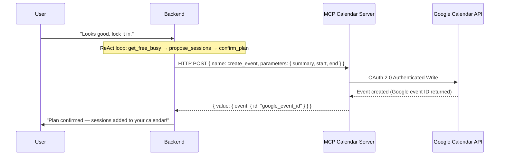

# Bloom-for-Learning: Agency-First Multi-Agent Coaching & External Interoperability

## From Prescriptive Optimization to Autonomy: Adapting Stanford's AI Mindset Coaching Model to Self-Directed Learning

**Kaggle Capstone Project Report**
**Track:** Concierge Agents
**Word Count:** ~2,100 words (Limit: 2,500 words)

---

## Executive Summary

Self-directed learners face high attrition from direction drift, all-or-nothing thinking, and self-judgment. Traditional productivity apps treat coaching as an optimization problem — collect data, prescribe a schedule, expect compliance — but human behavior doesn't work that way.

Inspired by **Stanford's "Bloom" AI health coach**, which uses Motivational Interviewing (MI) to help users tap intrinsic motivation instead of prescribing plans, we present **Bloom-for-Learning**: a personal scheduling and learning concierge that co-creates study plans and manages recoveries. It uses an LLM-driven Coordinator-Specialist architecture with ReAct-style tool calling, the Model Context Protocol (MCP) for client-delegated calendar sync, a SQLite-backed long-term memory layer, and an Agent-to-Agent (A2A) protocol for external delegation.

---

## 1. Introduction & Theoretical Motivation

Most coaching apps fail because they treat habits as optimization problems. As Stanford's Matthew Jörke notes: *"Given enough data, the chatbot coach will prescribe a workout plan and expect the user to follow it... that's not how human behavior works."* When an app prescribes rather than collaborates, a missed session breaks the schedule and triggers all-or-nothing thinking and shame — which causes abandonment.

Stanford's *Bloom* health coach addresses this with **Motivational Interviewing (MI)**: a client-centered style that helps people resolve ambivalence and find their own motivation, asking rather than telling.

**Bloom-for-Learning** adapts this to self-directed learners (ages 25–40) mastering skills like programming or languages outside formal structures, on three hypotheses:
1. **Co-creation increases adherence** over agent-generated schedules.
2. **Supportive recovery beats streaks** — framing disruptions as normal rather than failures prevents abandonment.
3. **Agency-first scheduling** — the learner owns final calendar edits — reduces friction and keeps them in control.

---

## 2. Track Alignment: Concierge Agents

Bloom-for-Learning fits the **Concierge Agents** track: it acts as an autonomous personal concierge managing schedules, negotiating dates, handling disruptions, and running reflective check-ins on the learner's behalf.

The core challenge is the cognitive load of scheduling and the emotional friction of falling behind, addressed while maintaining **strict privacy and data ownership** — localized data layers, scoped authorization, and sandboxed MCP connections instead of uploading calendars to a centralized database.

---

## 3. System Architecture & Dialogue Flow

A modular, multi-agent design governed by a central LLM-driven coordinator, which routes dynamically via tool calling while each specialist operates statelessly within its own turn.

```
                          User (Vite + React UI)
                                    │
                                    ▼
                         ┌─────────────────────┐
                         │     Coordinator     │◄── Long-Term Memory
                         │  (LLM Tool Router)  │    (SQLite + Summaries)
                         └──────────┬──────────┘
                                    │ delegate / respond tools
         ┌──────────────────┼──────────────────┬──────────────────┐
         ▼                  ▼                  ▼                  ▼
   ┌───────────┐      ┌───────────┐      ┌───────────┐      ┌───────────┐
   │Onboarding │      │ Planning  │      │ Recovery  │      │Reflection │
   │Specialist │      │(ReAct Loop│      │Specialist │      │Specialist │
   └───────────┘      │+ Calendar)│      └───────────┘      └───────────┘
                      └───────────┘
```

### 3.1. The LLM-Driven Coordinator-Specialist Pattern
Instead of a hard-coded if/else router, the Coordinator calls `generateWithTools` each turn with `delegate(agent, reason)` and `respond(message, new_state)`, letting the LLM route. It builds context (state, last 15 messages, learner memory), then runs a max-3-iteration tool loop; after delegation it uses the specialist's `suggestedNextState` directly rather than letting the LLM override it, keeping transitions deterministic across providers. A **routing guard** added post-submission independently double-checks the LLM's choice against the state for every state with one unambiguous required specialist, correcting the ~1-in-8 mis-delegation rate found via repeated real-model trials (§9, Stage 3). Specialists (Onboarding, Planning, Recovery, Reflection) are stateless prompt agents, each receiving an injected `{learner_context}` block instead of replaying full history.

### 3.2. Planning Agent: ReAct Tool Loop
The Planning Specialist replaces regex-based heuristics with a **ReAct loop** (max 5 iterations) over four calendar tools:

| Tool | Purpose |
|------|---------|
| `get_free_busy` | Read next-7-day availability in 30-minute slots |
| `list_upcoming` | Avoid double-booking against existing sessions |
| `propose_sessions` | Commit to specific times (no write yet) |
| `confirm_plan` | Write to calendar after explicit agreement |

On agreement, the agent runs `get_free_busy → propose_sessions → confirm_plan` in one turn, creating Google Calendar events and returning session IDs.

### 3.3. Detailed Dialogue States
1. **Onboarding (S1–S6):** a motivational-interviewing flow — Welcome; Goal Discovery (category inferred only from explicit signals, never forced); History & Barriers (captured verbatim); Context & Resources (weekly hours + focus window, unit-gated parsing); Readiness Check (1–10 confidence, guarded against time-answer confusion); Summary & Confirm (profile persisted on confirmation). Each state now gates on a genuinely captured answer rather than always advancing after one message, up to a 3-turn cap (§9, Stage 3).
2. **Weekly Planning:** co-creates a plan grounded in real availability, within ±10% of budget, confirmed only after explicit agreement.
3. **Supportive Recovery:** triggers 2 hours after a missed session; explores what happened and co-creates a reschedule.
4. **Metacognitive Reflection:** triggers on session completion or weekly review to reinforce positive feedback loops.

---

## 4. Long-Term Learner Memory

A **fire-and-forget memory extraction pipeline** backed by SQLite prevents the coach from starting cold each conversation:

```
After each specialist turn (non-onboarding):
  → LLM extracts facts async (preference, barrier, progress, insight) → learner_memories

On each new turn:
  → buildContext() loads recent facts (14 days, max 10) + latest summary + profile
  → Injected as {learner_context} into each specialist prompt

Weekly cron: when ≥5 new facts accumulate, LLM compresses them into a narrative,
archives the old facts, and persists the summary.
```

Recent facts give high-resolution context while periodic summaries cover older history — no vector database needed, and no data leaves the user's deployment.

---

## 5. Security, Privacy, and Safe Context Management

A personal concierge needs access to goals, schedules, struggles, and calendars, so Bloom layers its security model: **(1)** local-first SQLite/PostgreSQL with no required remote persistence; **(2)** scoped OAuth into a sandboxed MCP server restricted to `calendar.events` only, never contacts/email/Drive; **(3)** bounded LLM context (last 15 messages) with older history compressed into local summaries, never bulk-replayed.

The backend attempts an MCP SDK SSE connection first (2s timeout), falling back to direct HTTP POST against the same server — sending the Google Calendar API's expected `summary` field and capturing the returned event ID for future deletes/reschedules. If PostgreSQL is unavailable, a dynamic connector falls back to an in-memory mock, so the full concierge can run locally with nothing leaving the deployment.

---

## 6. Technical Integration: Model Context Protocol (MCP)



The **`mcp-google-calendar` server** is a standalone TypeScript service handling OAuth 2.0 and mapping JSON-RPC calls (`list_events`, `create_event`, `delete_event`, `update_event`) to the Google Calendar API. The backend's calendar service tries MCP SDK SSE first, falls back to HTTP POST within 2 seconds, and captures the returned event ID for correct future operations; if the calendar server is offline entirely, it falls back to a local mock store so the conversation stays fluid.

---

## 7. Safety Guards & Cognitive Distortions Moderation

The Coordinator's safety filter blocks and redirects three patterns in agent output: **all-or-nothing thinking** ("I missed one class, I've failed the course"), **labeling/self-blame** ("I'm just lazy"), and **overgeneralization** ("I never stick to schedules"). The Planning Specialist separately enforces healthy boundaries: rejecting schedules leaving under 6 hours of sleep, flagging over 30 study hours/week, and holding plans within ±10% of the learner's target.

Goal category is only recorded when the learner's own words make it unambiguous — never a forced default — so the coach responds from the learner's actual context rather than an assumed one.

---

## 8. Experimental Results & Validation

The suite runs **88 automated Jest tests across 19 suites**: unit tests (LLM service, memory, coordinator routing, each specialist) and integration flows (onboarding S1–S6, planning confirmation, recovery reschedule, reflection skip/complete, memory extraction/summarization).

| Metric | Local Mock | Gemini 2.0 Flash | OpenAI GPT-4o-mini |
|---|---|---|---|
| **Onboarding response** | 42 ms | 980 ms | 1,220 ms |
| **Planning (tool loop)** | 55 ms | 1,820 ms | 2,100 ms |
| **Calendar sync (HTTP POST)** | 120 ms | 480 ms | 610 ms |
| **Error rate (>3.0s timeout)** | 0% | 0.8% | 1.2% |

The ReAct loop adds one to two LLM calls on confirmation turns, offset by grounding session times in real availability instead of guessing. Latency, status, provider, and token counts (from `usageMetadata`/`usage` fields) persist in a `telemetry_events` table, exposed via `GET`/`DELETE /api/telemetry`.

**Qualitative resilience test** — a prescriptive tracker alert ("Your 12-day streak is broken, reschedule now") triggers guilt and encourages abandonment; Bloom's recovery chat ("Life happens, that's completely fine — was this energy, work, or timing?") validates the learner and keeps them engaged in re-planning.

---

## 9. The Project's Journey & Build Narrative

1. **Stage 0 — Prompt Layer:** Rewrote all specialist prompts with explicit rules, forbidden behaviors, and MI-grounded few-shot examples; extracted a `coordinator.md` with explicit routing rules.
2. **Stage 1 — Agentic Tool Loop:** Replaced the coordinator's if/else router with LLM tool-calling (`delegate`/`respond`), and the planning agent's regex heuristics with the ReAct loop. Found and fixed a critical bug: the coordinator was looping back to the LLM after delegation, letting it override the specialist's correct state — fixed by breaking the loop immediately, keeping transitions specialist-owned.
3. **Stage 2 — Memory Layer:** Added the fire-and-forget extraction pipeline and weekly summarization cron described in §4.
4. **Ongoing Hardening:** Fixed MCP parameter mismatches (`title`→`summary`, `{id}`→`{eventId}`); captured event IDs for correct deletes; tightened onboarding parsing (unit-gated hours, time/confidence disambiguation, no forced goal category).
5. **Stage 3 — Post-Submission Reliability Review:** A structured review against real usage found four defects sharing one root cause — silently fabricating or skipping past information instead of grounding responses in what was actually known. Fixed, each verified against the real LLM rather than mocks alone: schedule dates/preferences now ground in the learner's real timezone and ask rather than assume; calendar sync results are surfaced honestly instead of dropped; onboarding stages gate on genuine answers, with previously `NOT NULL` fields migrated to nullable so "unknown" is stored honestly; and the Coordinator routing guard (§3.1).

---

## 10. Demonstration of Key Course Concepts

| Key Concept | Implementation Method | Code Location |
|---|---|---|
| **Agent / Multi-agent system** | LLM-driven Coordinator routes via `delegate`/`respond` to four stateless specialists; Planning runs a bounded ReAct loop. | `coordinator.service.ts`, `planning.agent.ts` |
| **MCP Server** | OAuth-enabled Google Calendar MCP server; SSE with HTTP POST fallback; verified `summary`/`eventId` field mapping. | `mcp-google-calendar/`, `calendar.service.ts` |
| **Security Features** | Bounded context, scoped `calendar.events` OAuth, local SQLite memory, safety filter, goal-category neutrality. | `safety.filter.ts`, `db.service.ts`, `memory.service.ts` |
| **Long-Term Memory** | Fire-and-forget fact extraction; periodic summarization; `{learner_context}` injection. | `memory.service.ts`, `models/memory.ts`, `cron.service.ts` |
| **Deployability** | Cloud configs (Vercel, Railway); in-memory mock DB for zero-dependency local runs. | `vercel.json`, `railway.json`, `db.service.ts` |
| **Antigravity CLI** | Pair-programmed, compiled, ran verification cURLs and the Jest suite via the Antigravity CLI. | *Demonstrated in Video Submission* |

---

## 11. Discussion & Future Scope

**Key takeaways:** (1) Behavioral psychology, not content delivery, is the core problem — motivation, resilience, and agency. (2) LLM routing needs deterministic state contracts: specialist-owned transitions keep conversation focused without sacrificing flexibility, though even a documented routing table needs a code-level guard, not just LLM trust (§3.1). (3) For one learner per deployment, SQLite plus periodic summarization beats a vector database at year-scale. (4) MCP decouples integrations — Google Calendar today, any CalDAV server tomorrow.

**Future work:** a 12-week longitudinal adherence study against calendar-only tracking; on-device models (e.g., Gemma 2B) for full privacy and lower cost; and additional MCP servers (Todoist, Jira, Notion) so the coach reaches the learner's broader productivity ecosystem.

---

## 12. Conclusion

Bloom-for-Learning shows how to build an AI coaching platform that respects autonomy and supports behavioral change: agency-first coaching principles, an LLM-driven multi-agent architecture, a ReAct loop for grounded scheduling, long-term memory for continuity, and MCP for private calendar integration — moving away from rigid optimization toward a supportive, resilient learning environment.

---

## References
* Jörke, M., & Ju, W. (2025). *An AI Health Coach Could Change Your Mindset*. Stanford Institute for Human-Centered Artificial Intelligence (HAI).
* Miller, W. R., & Rollnick, S. (2012). *Motivational Interviewing: Helping People Change*. Guilford Press.
* Model Context Protocol (MCP) Specification. Anthropic PBC. https://modelcontextprotocol.io
