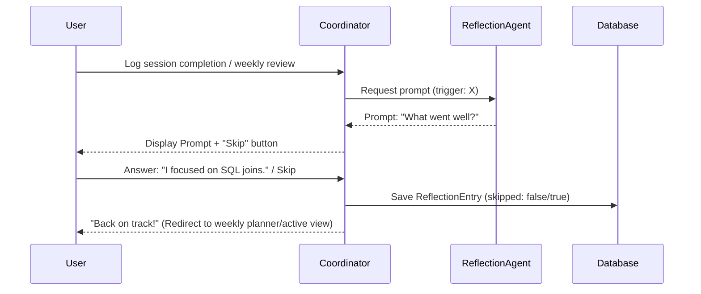

# Research: Reflection Agent Triggers and Flow

This document compiles technical decisions, prompt strategies, and schema definitions for the Reflection Agent.

---

## 1. Trigger Types and Prompt Strategy

The `ReflectionAgent` operates on three distinct event triggers:

1. **`session_completion`**:
   * *Trigger*: A user updates a planned session's status to `completed` in-app.
   * *Prompt Style*: Immediate, highly focused on the micro-action (e.g., "What went well today? What made starting feel easy?").
2. **`weekly_review`**:
   * *Trigger*: The user initiates weekly planning for the upcoming week.
   * *Prompt Style*: Synthesis, focused on macro-consistency (e.g., "What felt like a win this week? What rhythm worked best?").
3. **`recovery_completion`**:
   * *Trigger*: The user successfully completes a rescheduling flow after a missed session.
   * *Prompt Style*: Growth-oriented, reinforcing speed-of-return (e.g., "Coming back is what counts. What helped you return today?").

---

## 2. In-App Dialogue Integration

---

## 3. Alternative Approaches Considered

### Option A: Fully dynamic AI-driven prompts
* *Detail*: Pass the entire conversation history to an LLM to generate a custom question.
* *Rejected Because*: Increases latency to >4s (violates Constitution gate) and introduces risk of off-topic drift.
* *Decision*: Use template-based structured prompts with low-latency stateless variables.
